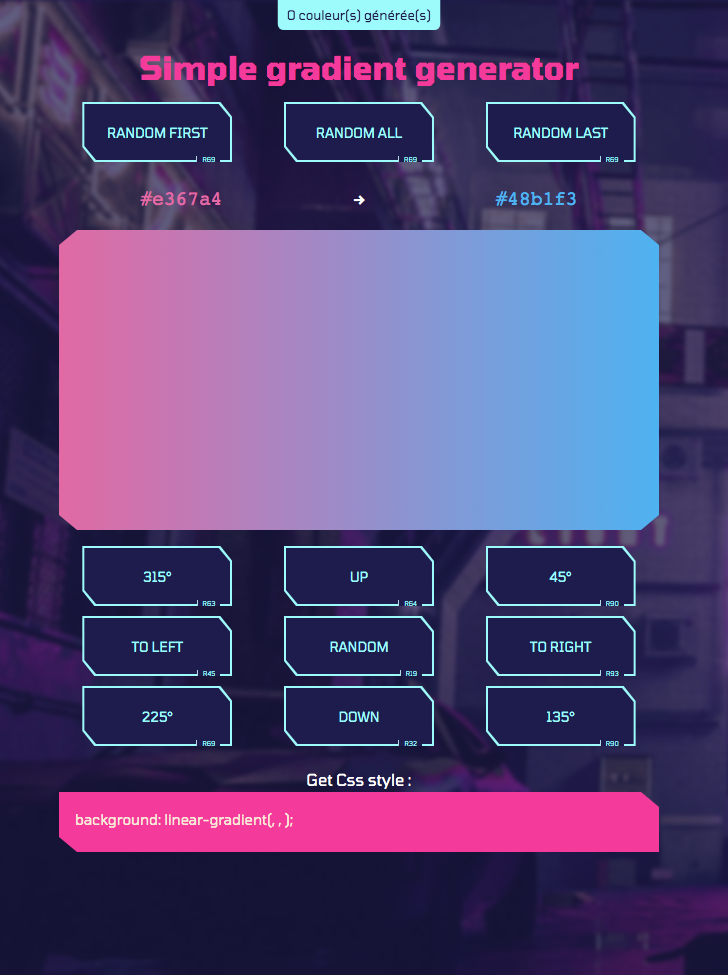

# React-gradient-vanilla
 
## About The Project 
# Convertisseur

Simple gradient generator made with react and redux.



### Built With

* :fr: React
* 🐙 Github
* 💻 VS Code

<!-- GETTING STARTED -->
## Getting Started

To get a local copy up and running follow these simple steps.

### Prerequisites

This is an example of how to list things you need to use the software and how to install them.
* Git
```sh
sudo apt-get install git
```

Clone this repo 

Then install react with cli
```sh
yarn
```
Launch server with
```sh
yarn start
```
Go to http://localhost:8080

Enjoy !

<!-- USAGE EXAMPLES -->
## Usage

You can grab this code, and try yourself this small App :)


<!-- CONTACT -->
## Contact

Basseguy Dimitri - [@twitter.com/Kulexus](https://twitter.com/Kulexus) - dimitri.basseguy@gmail.com

Project Link: [https://github.com/Dimitri-Basseguy/React-gradient-vanilla](https://github.com/Dimitri-Basseguy/React-gradient-vanilla)


<!-- ACKNOWLEDGEMENTS -->
## Acknowledgements

* Stay safe.